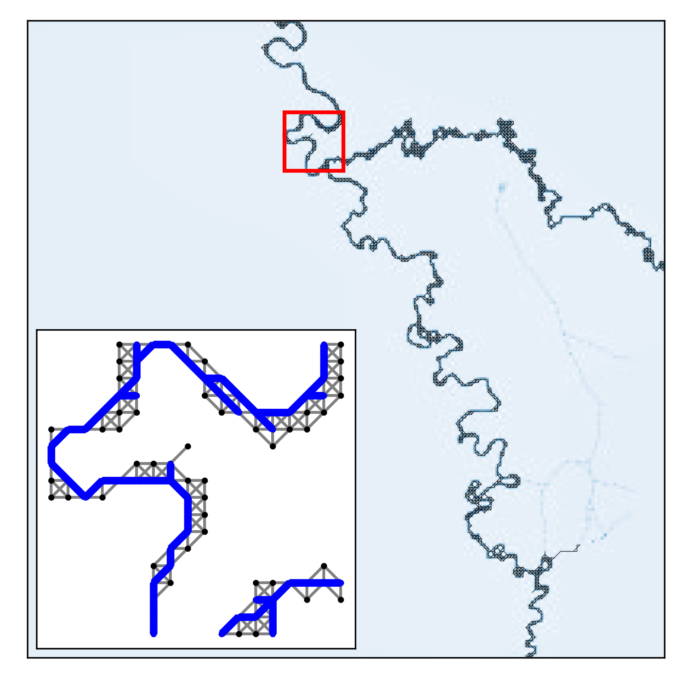

# Img2net: from images to networks

Python implementation of the _img2net_ algorithm proposed in:

- [1] Baptista D. & De Bacco C. (2020). *Automatic and principled network extraction from images*, <span style="color:blue"> arxiv link.



If you use this tool please cite [1].

## What's included?

## Requirements

This repository uses some of the functions proposed on the repository _Nextrout_[2], thus, it is necessary to clone it:

- [Nextrout](https://github.com/Danielaleite/Nextrout)

Once _Nextrout_ is cloned, the next step is to install the other python packages found in `requirements.txt`:

```
pip install -r requirements.txt
```

## Test

To test the tool, please go the folder `test` inside `code` folder and execute

```bash
python test_img2net.py
```
This will execute _img2net_ on a test image contained in the `input` folder; results will be stored in the folder `runs`.